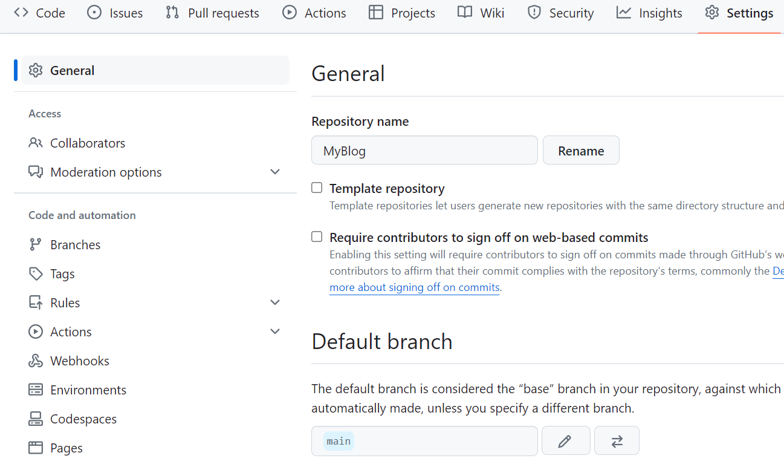
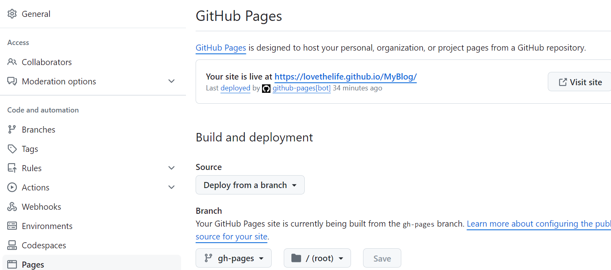

## 环境

- "vue": "^3.4.27",
- "vuepress": "2.0.0-rc.9",
- "vuepress-theme-hope": "2.0.0-rc.43"

## 安装

```
1 安装node.js
2 安装vue
npm install vue@3.4.27
3 安装主题vuepress-theme-hope
在 [dir] 文件夹内新建 vuepress-theme-hope 项目:
npm init vuepress-theme-hope@latest [dir]
5 启动
6 访问
pnpm docs:dev 启动开发服务器
pnpm docs:build 构建项目并输出
pnpm docs:clean-dev 清除缓存并启动开发服务器
```
## 部署到github
```
- [参考官方文档 ](https://vuejs.press/zh/guide/deployment.html#github-pages)
- 设置正确的 base 选项。
如果你准备发布到 https://<USERNAME>.github.io/ ，你可以省略这一步，因为 base 默认就是 "/" 。(仓库名修改为用户名.github.io)
如果你准备发布到 https://<USERNAME>.github.io/<REPO>/ ，也就是说你的仓库地址是 https://github.com/<USERNAME>/<REPO> ，则将 base 设置为 "/<REPO>/"(仓库名不修改)
- 使用github的pages和actions部署
```

```
- actions使用官方提供的文档，需要修改的地方：
1 打包工具，比如pnpm可以修改成自己选择使用的命令
2 修改build_dir 为src/.vuepress/dist
3 添加文档中使用的分支gh-pages
3 github中的actions-general页面，Workflow permissions修改为Read and write permissions
4 github中的pages页面选择Branch为gh-pages分支
```

```
5 等待github部署项目，在visit site旁边出现网址，就可以访问了
```
## 注意
- npm和pnpm打包后生成的文件不同，建议项目一直使用同一个命令
- github网络不稳定的时候容易出现问题，确信自己的操作没问题的时候，多尝试几次基本能解决大部分问题

